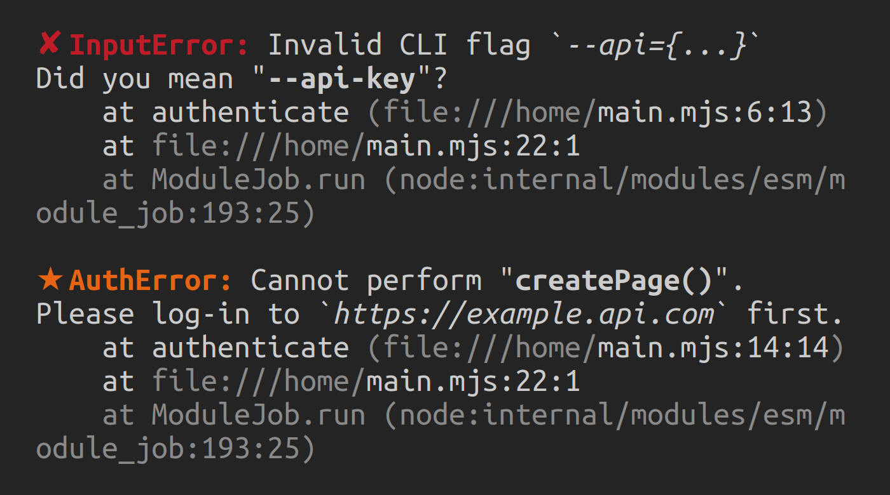

<picture>
  <source media="(prefers-color-scheme: dark)" srcset="https://raw.githubusercontent.com/ehmicky/design/main/beautiful-error/beautiful-error_dark.svg"/>
  
</picture>

[](https://www.npmjs.com/package/beautiful-error)
[](/src/main.d.ts)
[](https://codecov.io/gh/ehmicky/beautiful-error)
[](https://fosstodon.org/@ehmicky)
[](https://medium.com/@ehmicky)

Prettify error messages and stacks.

# Features

- 🖍️ Pretty [colors](#%EF%B8%8F-colors), [icons](#-icon) and [header](#-header)
- ⛑️ [Normalize](https://github.com/ehmicky/normalize-exception) invalid errors
- 🔕 Log verbosity: [stack](#-stack), [properties](#-props)
- 💥 Exception-safe

# Screenshot



# Example

```js
#!/usr/bin/env node
import beautifulError from 'beautiful-error'

try {
  // ...
} catch (error) {
  const message = beautifulError(error)
  console.error(message)
}
```

# Install

```bash
npm install beautiful-error
```

This package works in Node.js >=18.18.0.

This is an ES module. It must be loaded using
[an `import` or `import()` statement](https://gist.github.com/sindresorhus/a39789f98801d908bbc7ff3ecc99d99c),
not `require()`. If TypeScript is used, it must be configured to
[output ES modules](https://www.typescriptlang.org/docs/handbook/esm-node.html),
not CommonJS.

# API

## beautifulError(error, options?)

`error` `any`\
`options` [`Options?`](#options)\
_Return value_: `string`

Returns `error` as a prettified string.

This never throws. Invalid errors are silently
[normalized](https://github.com/ehmicky/normalize-exception).

### Options

#### 📕 stack

_Type_: `boolean`\
_Default_: `true`

Whether to show the error's stack trace.

#### 📢 props

_Type_: `boolean`\
_Default_: `true`

Whether to show the error's additional properties.

#### 🖍️ colors

_Type_: `boolean`\
_Default_: `true` in terminals, `false` otherwise

Whether to colorize the error's message, stack trace and additional properties.

Quoted strings in the error's message are printed in bold (for `"..."` and
`'...'`) and in italic (for `` `...` ``).

#### ❌ icon

_Type_: `string`\
_Default_: `'cross'`

Icon prepended to the error's name. The available values are listed
[here](https://github.com/sindresorhus/figures/blob/main/readme.md#figures-1).
Can be disabled by passing an empty string.

#### 💄 header

_Type_: `string`\
_Default_: `'red bold'`

Color/style of the error's [icon](#-icon) and name. The available values are
listed [here](https://github.com/ehmicky/chalk-string#available-styles). Several
styles can be specified by using spaces. Can be disabled by passing an empty
string.

# Related projects

- [`modern-errors`](https://github.com/ehmicky/modern-errors): Handle errors in
  a simple, stable, consistent way
- [`modern-errors-cli`](https://github.com/ehmicky/modern-errors-cli): Handle
  errors in CLI modules
- [`error-custom-class`](https://github.com/ehmicky/error-custom-class): Create
  one error class
- [`error-class-utils`](https://github.com/ehmicky/error-class-utils): Utilities
  to properly create error classes
- [`error-serializer`](https://github.com/ehmicky/error-serializer): Convert
  errors to/from plain objects
- [`normalize-exception`](https://github.com/ehmicky/normalize-exception):
  Normalize exceptions/errors
- [`is-error-instance`](https://github.com/ehmicky/is-error-instance): Check if
  a value is an `Error` instance
- [`merge-error-cause`](https://github.com/ehmicky/merge-error-cause): Merge an
  error with its `cause`
- [`set-error-class`](https://github.com/ehmicky/set-error-class): Properly
  update an error's class
- [`set-error-message`](https://github.com/ehmicky/set-error-message): Properly
  update an error's message
- [`wrap-error-message`](https://github.com/ehmicky/wrap-error-message):
  Properly wrap an error's message
- [`set-error-props`](https://github.com/ehmicky/set-error-props): Properly
  update an error's properties
- [`set-error-stack`](https://github.com/ehmicky/set-error-stack): Properly
  update an error's stack
- [`error-cause-polyfill`](https://github.com/ehmicky/error-cause-polyfill):
  Polyfill `error.cause`
- [`handle-cli-error`](https://github.com/ehmicky/handle-cli-error): 💣 Error
  handler for CLI applications 💥
- [`log-process-errors`](https://github.com/ehmicky/log-process-errors): Show
  some ❤ to Node.js process errors
- [`error-http-response`](https://github.com/ehmicky/error-http-response):
  Create HTTP error responses
- [`winston-error-format`](https://github.com/ehmicky/winston-error-format): Log
  errors with Winston

# Credits

The logo background was created by
[dgim-studio](https://www.freepik.com/free-vector/comic-dynamic-elements-set_7997347.htm).

# Support

For any question, _don't hesitate_ to [submit an issue on GitHub](../../issues).

Everyone is welcome regardless of personal background. We enforce a
[Code of conduct](CODE_OF_CONDUCT.md) in order to promote a positive and
inclusive environment.

# Contributing

This project was made with ❤️. The simplest way to give back is by starring and
sharing it online.

If the documentation is unclear or has a typo, please click on the page's `Edit`
button (pencil icon) and suggest a correction.

If you would like to help us fix a bug or add a new feature, please check our
[guidelines](CONTRIBUTING.md). Pull requests are welcome!

<!-- Thanks go to our wonderful contributors: -->

<!-- ALL-CONTRIBUTORS-LIST:START -->
<!-- prettier-ignore -->
<!--
<table><tr><td align="center"><a href="https://fosstodon.org/@ehmicky"><br /><sub><b>ehmicky</b></sub></a><br /><a href="https://github.com/ehmicky/beautiful-error/commits?author=ehmicky" title="Code">💻</a> <a href="#design-ehmicky" title="Design">🎨</a> <a href="#ideas-ehmicky" title="Ideas, Planning, & Feedback">🤔</a> <a href="https://github.com/ehmicky/beautiful-error/commits?author=ehmicky" title="Documentation">📖</a></td></tr></table>
 -->
<!-- ALL-CONTRIBUTORS-LIST:END -->
